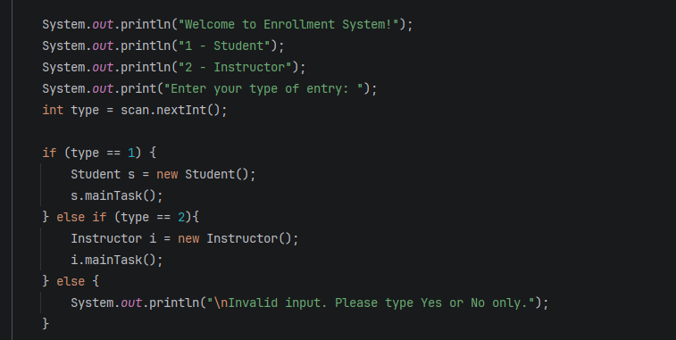
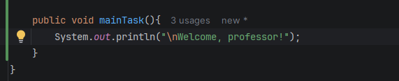
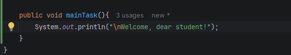
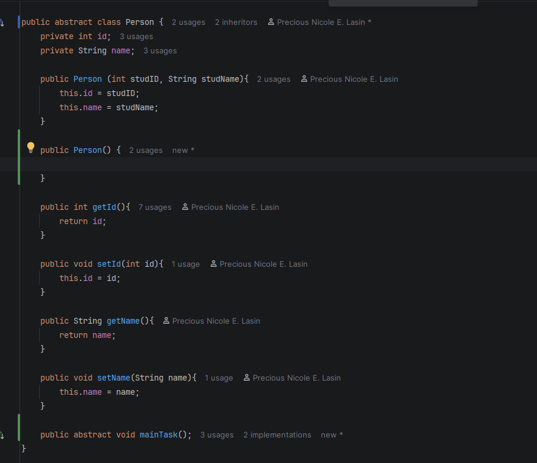
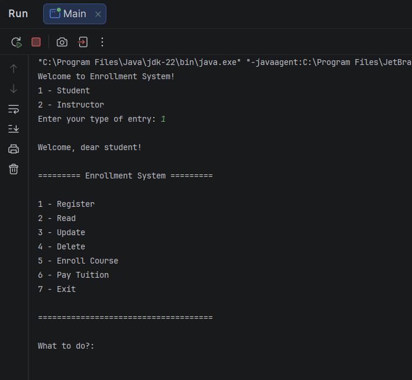
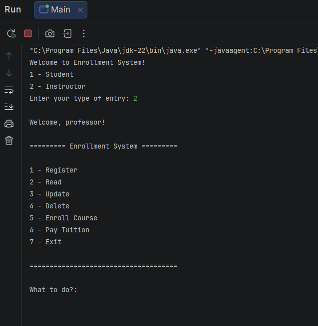

# Abstraction

-----
**Author**: Precious Nicole Lasin

**Description**: OOP Enrollment System | Abstraction | Output using setter and getter

**Screenshot**: Main.java

**Screenshot**: Instructor.java

**Screenshot**: Student.java

**Screenshot**: Person.java

**Screenshot**: Instructor output 

**Screenshot**: Student output

