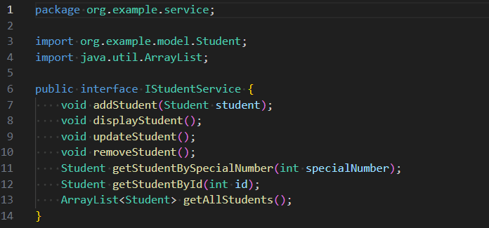
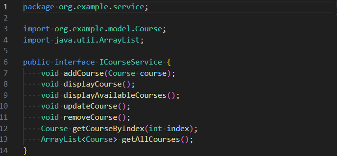
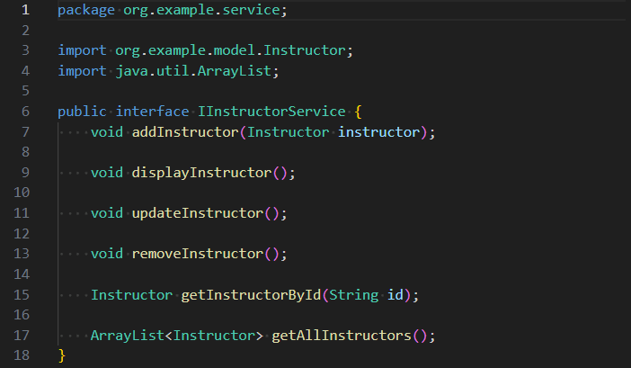
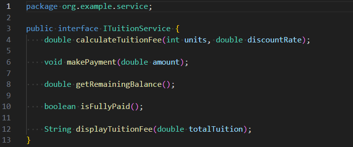
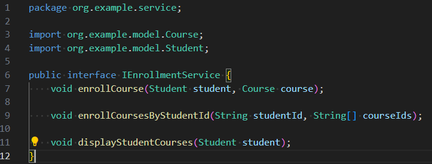
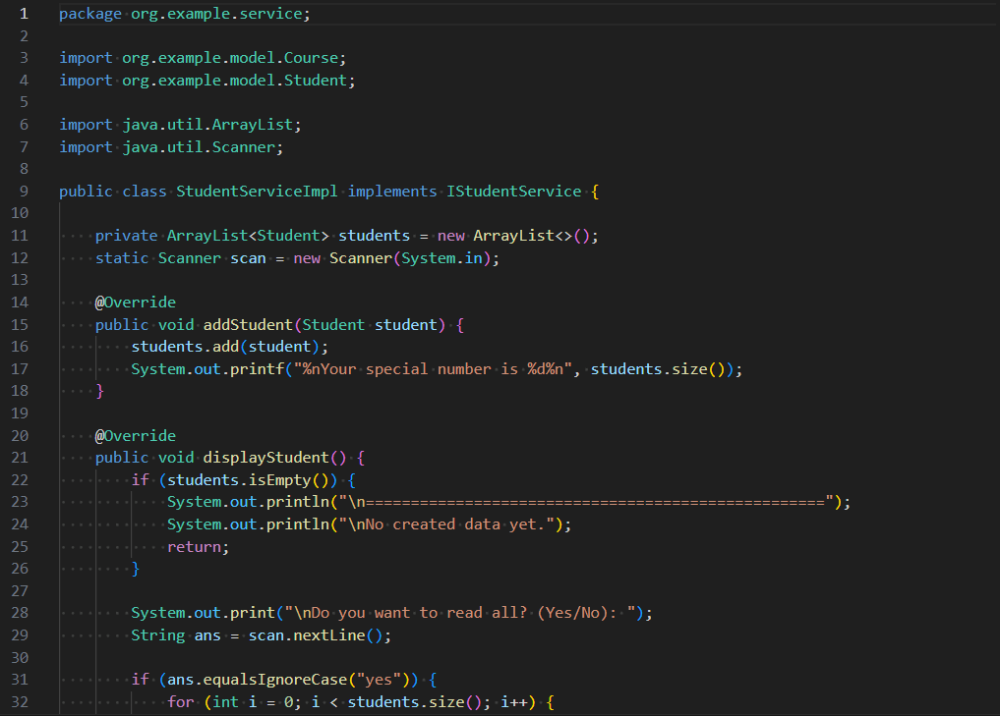
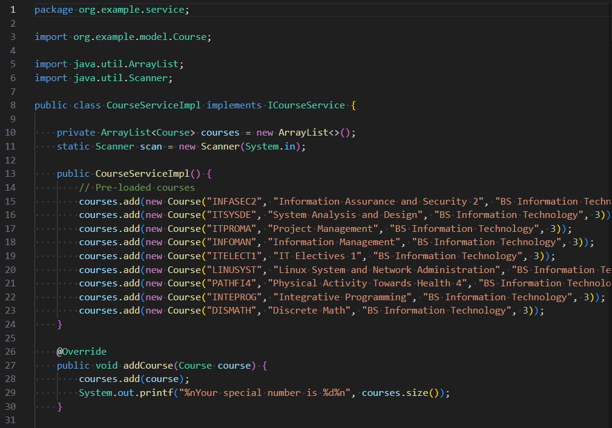
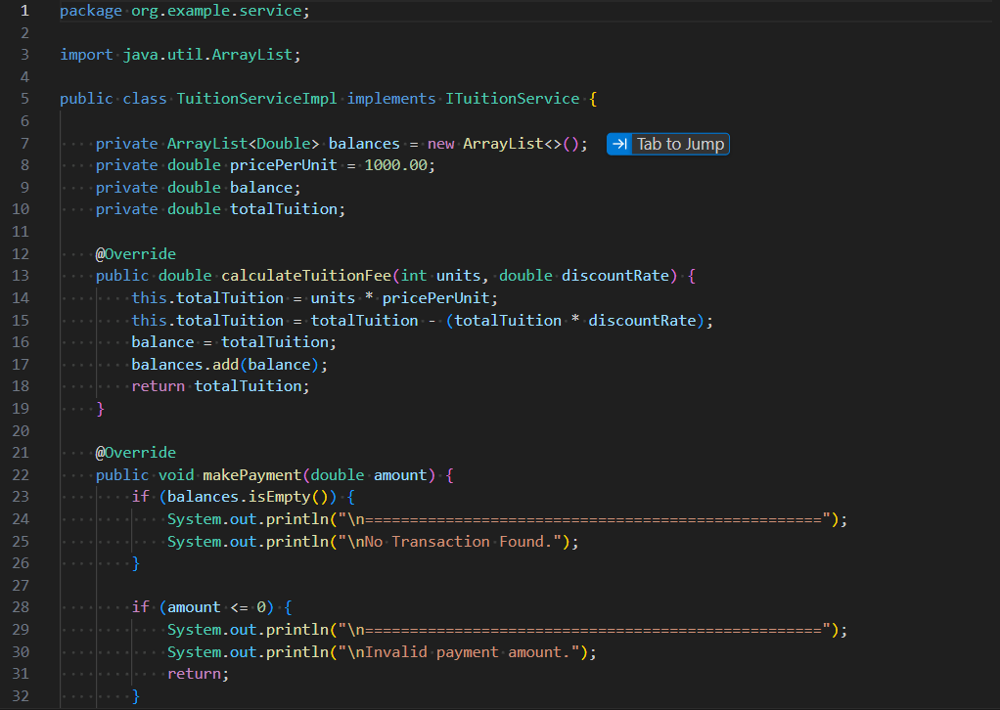
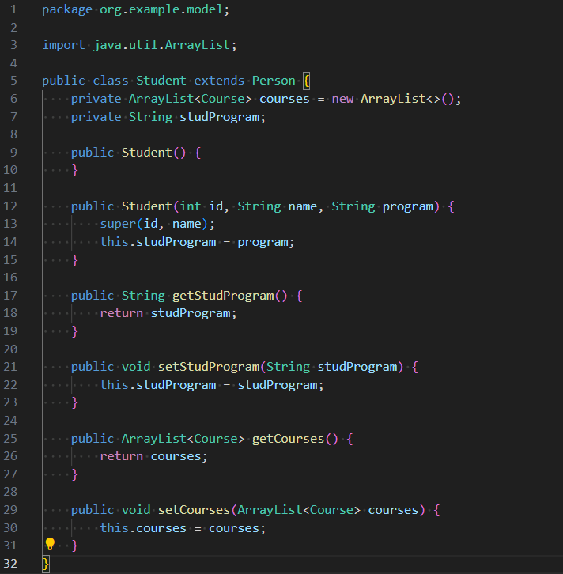
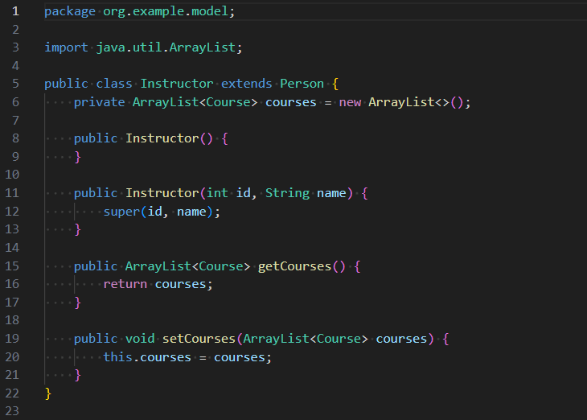

# Interface-Driven Enrollment System

-----
**Author**: Precious Nicole Lasin

**Description**: OOP Enrollment System | Capstone Project | Interface-Based Architecture using Java Interfaces and Implementation Classes

This update improves the Enrollment System by applying interface-driven architecture following Object-Oriented Programming principles and capstone project requirements. Business logic was separated from entity classes through the use of Java interfaces and implementation classes.

The system now uses service interfaces as method contracts while implementation classes handle the actual operations for student management, course management, enrollment, instructor handling, and tuition processing.

Entity classes were also cleaned and simplified to contain only attributes, constructors, and getter/setter methods.

## Features Implemented
- Student Management
- Course Management
- Instructor Management
- Tuition Fee Management
- Enrollment Management
- CRUD Operations using ArrayLists
- Interface-Based Architecture
- Separation of Concerns
- Console/CLI-Based Functionality

## Service Interfaces
- StudentService
- CourseService
- InstructorService
- TuitionService
- EnrollmentService

## Implementation Classes
- StudentServiceImpl
- CourseServiceImpl
- InstructorServiceImpl
- TuitionServiceImpl
- EnrollmentServiceImpl

## Entity Classes Cleaned
- Student
- Instructor
- Course
- Person

The entity classes now contain only:
- attributes
- constructors
- getters/setters

---

**Screenshot**: IStudentService.java

**Screenshot**: ICourseService.java

**Screenshot**: IInstructorService.java

**Screenshot**: ITuitionService.java

**Screenshot**: IEnrollmentService.java

**Screenshot**: StudentServiceImpl.java

**Screenshot**: CourseServiceImpl.java

**Screenshot**: TuitionServiceImpl.java

**Screenshot**: Cleaned Student.java

**Screenshot**: Cleaned Instructor.java

